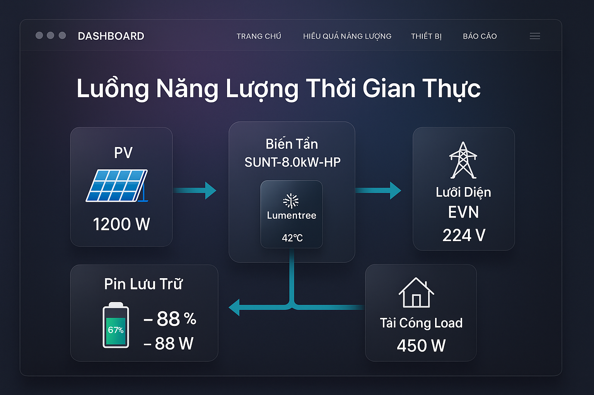
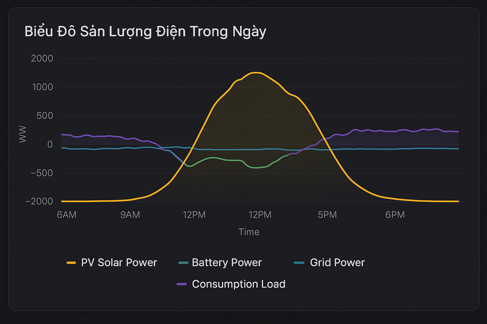
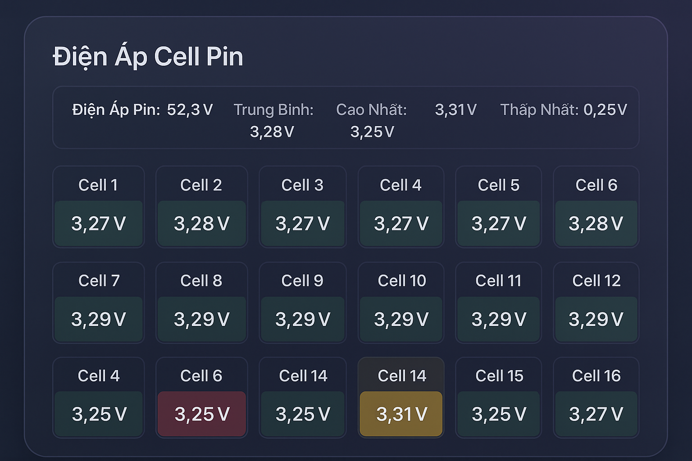

# LightEarth Web Pro - Giám Sát Năng Lượng Mặt Trời

<div align="center">


**Hệ thống giám sát năng lượng mặt trời thời gian thực cho biến tần Lumentree**

[Demo trực tiếp](https://solar-monitor-dashboard-production.up.railway.app/?deviceId=P250812032) | [Báo cáo lỗi](https://github.com/zixfel/lumentree-dashboard-main/issues) | [Yêu cầu tính năng](https://github.com/zixfel/lumentree-dashboard-main/issues)

</div>

---

## 📸 Ảnh Chụp Màn Hình

### Luồng Năng Lượng Thời Gian Thực
<div align="center">

</div>

> Giao diện chính hiển thị luồng năng lượng giữa các thành phần: **PV (Quang điện)** → **Biến tần Lumentree** → **Pin lưu trữ** / **Lưới điện EVN** / **Tải tiêu thụ**

### Biểu Đồ Sản Lượng Điện
<div align="center">

</div>

> Biểu đồ theo dõi công suất trong ngày: **PV (vàng)**, **Pin (xanh lá)**, **Lưới điện (xanh dương)**, **Tải (tím)**

### Điện Áp Cell Pin
<div align="center">

</div>

> Theo dõi điện áp từng cell pin với thông số: **Trung bình**, **Cao nhất**, **Thấp nhất**, **Độ lệch**

---

## 🎯 Giới Thiệu

**LightEarth Web Pro** là ứng dụng web toàn diện để giám sát và trực quan hóa dữ liệu năng lượng từ hệ thống điện mặt trời Lumentree. Ứng dụng cung cấp giao diện trực quan để theo dõi sản lượng điện mặt trời, tình trạng pin, tiêu thụ điện và tương tác lưới điện theo thời gian thực.

### ✨ Tính Năng Nổi Bật

| Tính năng | Mô tả |
|-----------|-------|
| **📡 Giám sát thời gian thực** | Kết nối MQTT broker nhận dữ liệu trực tiếp từ biến tần |
| **⚡ Luồng năng lượng trực quan** | Hiển thị dòng chảy năng lượng giữa PV, Pin, Lưới điện và Tải |
| **📊 Biểu đồ tương tác** | Biểu đồ Chart.js cho dữ liệu lịch sử và SOC |
| **🔋 Điện áp cell pin** | Theo dõi từng cell pin với độ lệch và cảnh báo |
| **📱 Giao diện responsive** | Tối ưu cho desktop và mobile (Zoom 90%) |
| **🌙 Dark/Light mode** | Chế độ sáng/tối tự động theo hệ thống |
| **🔄 Cập nhật SignalR** | Dữ liệu real-time không cần tải lại trang |

---

## 🛠️ Công Nghệ Sử Dụng

<table>
<tr>
<td align="center"><strong>Backend</strong></td>
<td align="center"><strong>Frontend</strong></td>
<td align="center"><strong>Real-time</strong></td>
<td align="center"><strong>Deploy</strong></td>
</tr>
<tr>
<td>

- ASP.NET Core 8.0
- MQTTnet
- RestSharp
- Serilog

</td>
<td>

- HTML5/CSS3
- JavaScript
- Tailwind CSS
- Chart.js

</td>
<td>

- SignalR WebSocket
- MQTT Protocol

</td>
<td>

- Railway
- Docker

</td>
</tr>
</table>

---

## 📊 Dữ Liệu Thu Thập Qua MQTT

### 🔌 Thông Tin Thiết Bị
- ID thiết bị và loại biến tần
- Phiên bản firmware
- **Nhiệt độ biến tần** (°C)
- Chế độ hoạt động (Hòa lưới/Độc lập/UPS)
- Trạng thái online/offline

### ☀️ Sản Lượng PV (Quang Điện)
- Điện áp PV1 và PV2 (V)
- Công suất PV1 và PV2 (W)
- Tổng công suất PV (W)

### 🔋 Thông Số Pin
| Thông số | Đơn vị | Nguồn dữ liệu |
|----------|--------|---------------|
| Điện áp pin tổng | V | `BatteryVoltage` |
| Phần trăm sạc | % | `BatteryChargePercentage` |
| Công suất sạc/xả | W | `BatteryPower` |
| Điện áp từng cell | V | SignalR real-time |
| Trạng thái | Đang sạc/Đang xả/Chờ | `BatteryStatus` |

### ⚡ AC Output/Input
- Điện áp AC đầu ra (V) - `AcOutputVoltage`
- Tần số AC (Hz)
- **Công suất AC** (W) - `AcOutputPower`
- Điện áp lưới điện (V) - `GridVoltage`
- Công suất lưới (W) - `GridPower`

### 🏠 Dữ Liệu Tiêu Thụ
| Loại tải | Nguồn dữ liệu | Mô tả |
|----------|---------------|-------|
| **Tải cổng load** | `AcOutputPower` | Essential Load (dự phòng) |
| **Tải hòa lưới** | `HomeLoad` | Toàn bộ tải trong nhà |

---

## 🚀 Cài Đặt

### Yêu Cầu
- **.NET 8.0 SDK** trở lên
- **Git**

### Hướng Dẫn Cài Đặt

```bash
# 1. Clone repository
git clone https://github.com/zixfel/lumentree-dashboard-main.git
cd lumentree-dashboard-main

# 2. Restore dependencies
dotnet restore

# 3. Build project
dotnet build

# 4. Chạy ứng dụng
dotnet run --project LumenTreeInfo.API

# 5. Truy cập
# HTTP:  http://localhost:5165
# HTTPS: https://localhost:7077
```

---

## 📁 Cấu Trúc Dự Án

```
lumentree-dashboard-main/
├── 📂 LumenTreeInfo.API/           # Web Application
│   ├── Controllers/                # API Controllers
│   ├── Views/                      # Razor Views
│   ├── wwwroot/                    # Static files
│   │   ├── css/                    # Stylesheets
│   │   ├── js/                     # JavaScript
│   │   └── icons/                  # Icons (Lumentree inverter, etc.)
│   └── DeviceHub.cs                # SignalR Hub
├── 📂 LumenTreeInfo.Lib/           # Core Library
│   ├── SolarInverterMonitor.cs     # MQTT Client
│   ├── LumentreeClient.cs          # API Client
│   └── Models/                     # Data Models
├── 📂 LumenTreeInfo.Cmd/           # Command Line Tool
├── 📂 screenshots/                 # Ảnh chụp màn hình
└── README.md
```

---

## 🌐 Triển Khai Production

### Railway (Khuyến nghị)

1. Fork repository về tài khoản GitHub
2. Đăng nhập [Railway](https://railway.app)
3. Tạo project mới từ GitHub repo
4. Railway tự động detect .NET và deploy

**Production URL:** https://solar-monitor-dashboard-production.up.railway.app

### Docker

```dockerfile
FROM mcr.microsoft.com/dotnet/aspnet:8.0
WORKDIR /app
COPY ./publish .
EXPOSE 5165
ENTRYPOINT ["dotnet", "LumenTreeInfo.API.dll"]
```

```bash
# Build Production
dotnet publish LumenTreeInfo.API -c Release -o ./publish
```

---

## ⚙️ Cấu Hình

### appsettings.json

```json
{
  "Logging": {
    "LogLevel": {
      "Default": "Information",
      "Microsoft.AspNetCore": "Warning"
    }
  },
  "SolarMonitor": {
    "UserId": "YOUR_USER_ID",
    "MqttBroker": "lesvr.suntcn.com",
    "MqttPort": 1886
  },
  "AllowedHosts": "*"
}
```

---

## 🔧 Khắc Phục Sự Cố

### ❌ Không kết nối được MQTT
- Kiểm tra kết nối internet
- Xác minh Device ID hợp lệ
- Kiểm tra MQTT broker: `lesvr.suntcn.com:1886`

### ❌ Không có dữ liệu biểu đồ
- Kiểm tra ngày đã chọn có dữ liệu
- Xác minh thiết bị online trong ngày đó
- Kiểm tra Console browser để xem lỗi

### ❌ SignalR không kết nối
- Kiểm tra WebSocket không bị chặn
- Xem Console browser để debug

---

## 🤝 Đóng Góp

1. Fork repository
2. Tạo branch mới: `git checkout -b feature/tinh-nang-moi`
3. Commit thay đổi: `git commit -m 'Thêm tính năng mới'`
4. Push lên branch: `git push origin feature/tinh-nang-moi`
5. Tạo Pull Request

---

## 📄 Giấy Phép

Dự án này được cấp phép theo [MIT License](LICENSE).

---

## 👨‍💻 Tác Giả

**LightEarth Team**

- 🌐 Website: [lightearth.vn](https://lightearth.vn)
- 📧 GitHub: [@zixfel](https://github.com/zixfel)

---

## 🙏 Lời Cảm Ơn

- [MQTTnet](https://github.com/dotnet/MQTTnet) - Thư viện MQTT
- [Chart.js](https://www.chartjs.org/) - Biểu đồ
- [Tailwind CSS](https://tailwindcss.com/) - Framework CSS
- [SignalR](https://dotnet.microsoft.com/apps/aspnet/signalr) - Real-time
- [Lumentree](http://www.lumentree.co/) - API và thiết bị

---

<div align="center">

**Được phát triển với ❤️ bởi LightEarth Team**

⭐ Nếu bạn thấy dự án hữu ích, hãy cho chúng tôi một star!

[](https://github.com/zixfel/lumentree-dashboard-main)

</div>
